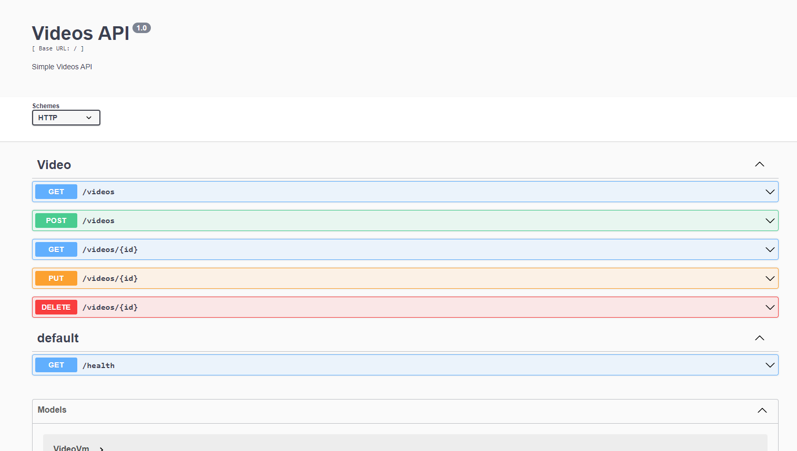

# Video API

A NestJS API template using TypeScript + MongoDB + Docker.

<p align="center">
  
</p>

### How do I get set up? ###

To run this project locally, first of all you need to clone this repository, the project has the following requirements: 

#### Requirements ####

* docker
* docker-compose

To run the project you need to run the following command: 

```sh
docker-compose build && docker-compose up
```

## Swagger


After start the container you can have access to all API routes accessing its Swagger Documentation on '/api' route

```sh
http://localhost:3000/api
```

## Test

Jest package was configured on the project, but it was not used on the entire project (No high coverage). To run tests you can simply run:

```sh
npm run test
```

## Implemented features

* GET /videos can use the following query parameters: page, limit, onlyPublic, viewedMoreThan.
* Requests Body are validated 
* Health check
